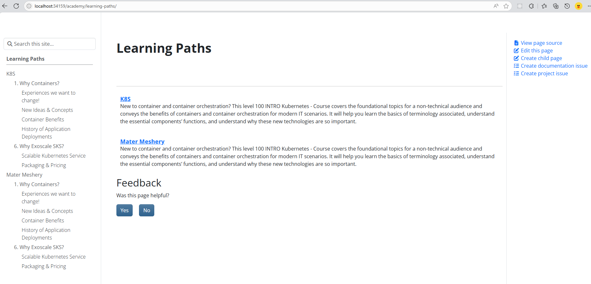
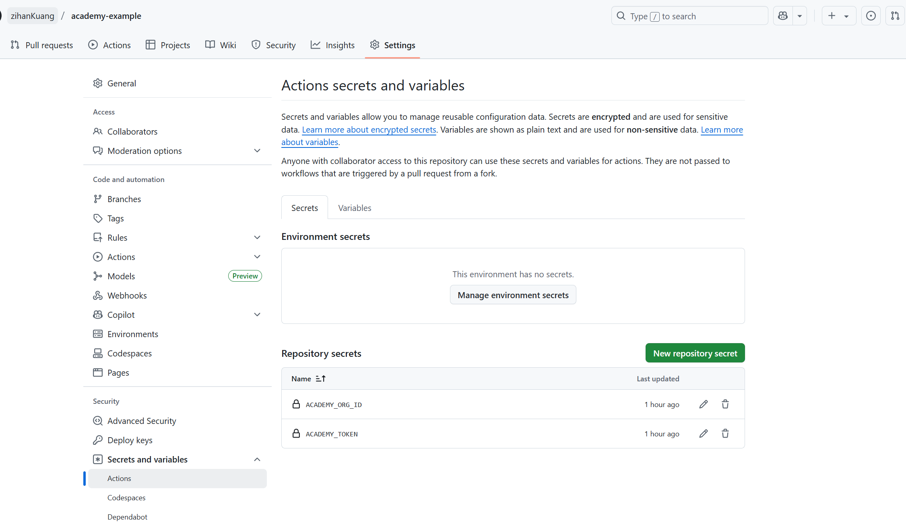
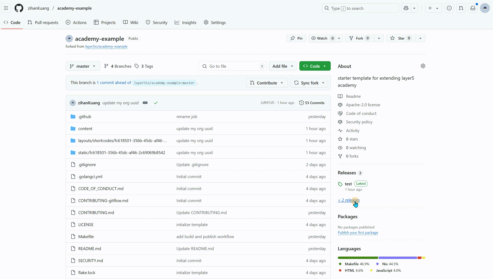

This guide provides a step-by-step walkthrough for creating and organizing a new learning path in the [Layer5 Academy](https://cloud.layer5.io/academy/content). You'll learn how to set up your content repository, structure your courses, add assets, preview your work, and publish it for your organization.

### Prerequisites

Before you dive into creating your first learning path, it's helpful to be familiar with the core technologies and concepts used by the Academy platform. 

- **Git and GitHub**: All learning content is managed in a Git repository.
- **Markdown**: All course and chapter content is written in standard Markdown. 
- **Hugo**: The entire Academy platform is built on the [Hugo](https://gohugo.io/) static site generator. 
- **Academy Template & Theme**: We provide an `academy-example` repository that serves as a pre-configured template. [Layer5 Academy theme](https://github.com/layer5io/academy-theme) to ensure your content is styled correctly right out of the box.
- **A Layer5 Cloud Account**: Required to obtain your Organization ID and Personal Access Token for publishing.

## 1. Set Up Your Content Repository

Start by preparing a dedicated Git repository for your learning content. Using our official Layer5 template to help you get started quickly.

1. **Fork the academy-example Repository**

- Go to the [academy-example repository](https://github.com/layer5io/academy-example) on GitHub.
- Click **Fork** to create a copy under your own GitHub account.

2. **Clone Your Fork Locally**

- Use the `git clone` command to download your forked repository. 
- Example:
  ```bash
  # Replace `<your-username>` with your actual GitHub username
  git clone https://github.com/<your-username>/academy-example.git
  cd academy-example
  git checkout -b <your-feature-branch>
  ```

3. **Update the Go Module Path**

    1. Open the `go.mod` file located at the root of your `academy-example` project.
    2. The first line will be:
      ```go
      module github.com/layer5io/academy-example
      ```
    3. Change this line to match your fork's path:
      ```go
      module github.com/<your-username>/academy-example
      ```
    4. Save the file, then commit and push this change to your repository.


This step is essential. It updates your repository's "identity card" (`go.mod`) to match its new "address" (your GitHub URL). Without this change, the Academy publishing process will fail.


## 2. Structure Your Learning Path

The Academy uses a specific directory layout to keep each organization's content separate and secure.

1. **Find Your Organization UUID**

    Each learning path is tied to a specific organization and secured by a unique identifier (UUID). This is a system-generated ID that ensures your content is scoped only to your organization.


You can find and copy your Organization UUID from your organization page on [Layer5 Cloud](https://cloud.layer5.io/identity/organizations).


2. **Create the Core Directories**

    Now, inside your `academy-example` project, you should see the following top-level folders.

    1. `content/learning-paths/<your-organization-uid>/`
      This `content` directory is where all your written material lives. The folder hierarchy you create here directly defines the navigation and organization of your learning paths.
    2. `layouts/shortcodes/<your-organization-uid>/`
      This `layouts` directory is for advanced use. You can place custom **Hugo Shortcodes** here if you need special reusable components.

3. **Build the Content Hierarchy**

    With the main folders in place, you can now structure your first course inside the `content` directory. The content is organized in a clear hierarchy: **Learning Path → Course → Chapter**.

    A high-level view of the structure looks like this:

    ```text
    content/
    └── learning-paths/
        ├── _index.md
        └── ea124d12-234a-6f78-9df0-1fa2b3e4d567/  // <-- Organization UID
            └── mastering-kubernetes/              // <-- Learning Path
                ├── _index.md
                └── advanced-networking/           // <-- Course 1
                └── core-concepts/                 // <-- Course 2
                    ├── _index.md
                    ├── 01-pods.md                 // <-- Chapter 1
                    └── 02-services.md             // <-- Chapter 2
                    └── arch.png                   // <-- Image
    ```

    Each folder represents a level in the hierarchy, and the `_index.md` file within a folder defines the metadata (like title and description) for that level. The final `.md` files are your individual Chapter.

> For a deeper understanding of how Hugo uses `_index.md` to create content sections, you can refer to the official [Hugo Page Bundles documentation](https://gohugo.io/content-management/page-bundles/).

4. **Front matter**

    Use this at the top of each **Learning Path** page (`learning-paths/<orgId>/<slug>/_index.md` or similar):

    ```yaml
    ---
    title: "Advanced Course"
    description: "This ADVANCED - Course is where to get the technical knowledge."
    weight: 5
    banner: "images/exoscale-icon.svg"
    id: "754627a3-7993-4b01-a7f0-c66c0212a1a1" 
    tags: [orchestration]
    categories: [introductory]
    ---
    ```

    > Place this frontmatter in the Markdown file that represents the learning path index page.

    **Course Frontmatter (Optional Individual Course Pages)**

    If each course has its own markdown page, you can use this frontmatter:

    ```yaml
    ---
    id: "Networks" 
    title: "Networks"
    description: "This course clear your Network concept"
    weight: 2
    banner: "images/kubernetes-icon.svg"      
    tags: [network]
    categories: [introductory]
    ---
    ```

    **Summary of Required Fields**

    | Applicable To   | Field         | Required | Notes                                                                      |
    | --------------- | ------------- | :------: | -------------------------------------------------------------------------- |
    | All             | `title`       |    ✅    | The main display title.                                                    |
    | All             | `description` |    ✅    | A brief summary of the content.                                            |
    | All             | `weight`      |    ✅    | Controls the display order (lower numbers appear first).                   |
    | All             | `banner`      |    ❌    | Path to an image in the `static` folder, e.g., `images/icon.svg`.          |
    | All             | `tags`        |    ❌    | Keywords for content discovery.                                            |
    | All             | `categories`  |    ❌    | The main categories for the content.                                       |
    | All             | `draft`       |    ❌    | If `true`, the page will not be published.                                 |
    | **Learning Path** | `id`          |    ✅    | **Crucial.** A stable UUID for tracking progress. **Do not change.** [^1]|
    | **Course** | `id`          |    ❌    | A simple, human-readable string identifier for the course.                 |
    | **Course** | `prerequisites` |    ❌    | Optional list of prerequisites for the course. |

> For a complete list of all predefined variables and advanced usage, please refer to the official [Hugo Front Matter documentation](https://gohugo.io/content-management/front-matter/).

## 3. Add Assets and Interactive Content

Enhance your course with images and other visual aids. The recommended and standard method for adding images is Page Bundling. This approach involves placing your image files directly alongside the Markdown content they belong to, which is simpler and keeps content organized.


For all assets, please use the Page Bundling method. It simplifies asset management by co-locating images with the Markdown files that use them.


**How to Add an Image**

1.  Place your image file (e.g., `hugo-logo.png`) in the **same directory** as your Markdown file (e.g., `Chapter-1.md`). 

2.  In your `Chapter-1.md` file, embed the image using a **standard Markdown link**. The path should just be the filename.

    ```markdown
    
    ```


The `usestatic` shortcode is **deprecated** and should not be used!


**How to Add a Video**

```text

<video width="100%" height="100%" controls>
    <source src="https://exmaple.mp4" type="video/mp4">
    Your browser does not support the video tag.
</video>

```

## 4. Build and Preview Locally

Before publishing, it is crucial to preview your content locally to check for formatting errors, broken links, and overall structure.

```bash
make site
```

This will start a local development server, where you can view your learning path as you build it.



The local preview uses a generic theme to show the structure and content of your learning path. It **will not** display your organization's specific branding, such as custom logos or color schemes.

You can configure your organization's branding in the [Layer5 Cloud Organization Settings](https://cloud.layer5.io/identity/organizations).


## 5. Publishing Your Learning Path

Once you have tested your content locally, you can publish it to the [Layer5 Academy](https://cloud.layer5.io/academy/content) through our automated workflow. 

To help you visualize how your content goes from a local file to a live learning path, the diagram below illustrates the entire end-to-end publishing workflow. It shows which components you will interact with directly and how the CI/CD pipeline handles the rest automatically.



The process involves a one-time setup of secrets in your repository, followed by creating a GitHub Release to publish each new version of your content.

### Stage 1: Configure the Publishing Workflow (One-Time Setup)

To allow your repository to securely communicate with the Academy's build system, you must configure GitHub Secrets. This one-time setup ensures your publishing workflow can authenticate automatically.

#### 1. Verify Required Secret Names

First, confirm the **exact secret names** required by the workflow.

In your repository, open the workflow file at `.github/workflows/build-and-release.yml`. This confirms the workflow expects secrets named exactly `ACADEMY_ORG_ID` and `ACADEMY_TOKEN`.
  ```yaml
  with:
    orgId: ${{ secrets.ACADEMY_ORG_ID }}
    token: ${{ secrets.ACADEMY_TOKEN }}
    # ... and other parameters
  ```

#### 2. Set Up Repository Secrets

Now, create the two required secrets in your repository.

1.  Navigate to your GitHub repository and go to `Settings` > `Secrets and variables` > `Actions`.
2.  Ensure you are on the **Secrets** tab.
3.  Click `New repository secret` to add the following two secrets:
    1. **Name:** `ACADEMY_ORG_ID` 

       **Value:** Paste your unique Organization ID string.

    2. **Name:** `ACADEMY_TOKEN` 

       **Value:** Paste the personal access token generated from Layer5 Cloud by following the instructions below.


When you generate a token from the [Layer5 Cloud Tokens page](https://cloud.layer5.io/security/tokens), you will get a JSON object like this:
`{"meshery-provider":"Meshery","token":"eyj...your-long-token-string..."}` You must copy only the token string itself—the value inside the quotes for the `"token"` key. 

Do NOT include the curly braces `{}`, the `"token":` key, or the surrounding quotes. The value you paste into the secret should begin with `eyj...`.


Once configured correctly, your secrets page should look like this:



While you can hardcode your `ACADEMY_ORG_ID` directly in the workflow file, we strongly recommend using secrets for better security and flexibility.


### Stage 2: Publish by Creating a GitHub Release

With the setup complete, you can publish your content anytime by creating a new release.

1.  Ensure all your latest changes are committed and pushed to your repository's `master` branch.
2.  On your GitHub repository page, navigate to the **"Releases"** section.
3.  Click **"Draft a new release"**.
4.  Create a new version tag for your release (e.g., `v1.0.1`).
5.  Provide a title and description for your release.
6.  Click **"Publish release"**.

This action will automatically trigger the workflow, and your content will be deployed to the [Layer5 Academy](https://cloud.layer5.io/academy/content).

- Your content will be available in the [staging environment](https://staging-cloud.layer5.io/) within approximately 10 minutes.
- Your content will go fully live to the production Academy platform during the next scheduled cloud release.

> **For Urgent Updates:** If you have a time-sensitive publishing request or encounter any issues with the automated process, please [contact the Layer5 team](https://layer5.io/company/contact) for expedited assistance.



## 6. Ongoing Maintenance and Updates

Once your learning path is live, you may need to perform routine tasks to keep your local environment and dependencies up-to-date.

### Updating the Academy Theme
The  [`academy-theme`](https://github.com/layer5io/academy-theme) provides the core layout, style, and features for your learning path. Regularly updating it ensures you benefit from the latest improvements and bug fixes.

To upgrade to the latest theme version, run: 
```bash
make theme-upgrade
```

You will see output similar to this as Hugo fetches the new modules:
```bash 
hugo mod get -u
hugo: collected modules in 1707 ms
go: downloading github.com/layer5io/academy-theme v0.1.6
go: upgraded github.com/layer5io/academy-theme v0.1.5 => v0.1.6
go: upgraded github.com/twbs/bootstrap v5.3.6+incompatible => v5.3.7+incompatible
```


It's a good practice to update the theme before creating a new release or when you notice that your local preview is missing recent design changes.


### Clearing the Local Cache for Troubleshooting

If you encounter unexpected formatting issues or your content doesn't update correctly during local development, your build cache might be stale. Use the `make clean` command to resolve this.
This command first deletes the local build cache (`public` directory) and then restarts the development server, ensuring you are previewing a fresh build of your content.
```bash
make clean
```

Renaming a course or module after publication would break the learning path tracking for enrolled learners. It's like changing chapters while someone is following the story. Consider updating the module’s description, adding an introductory note, or creating a versioned copy.



## Frequently Asked Questions

1. **Why is my workflow failing with a `401 Unauthorized` or `user must be logged in` error?**

    This error indicates an issue with your **`ACADEMY_TOKEN`**. Please ensure you have correctly copied **only the token string** and not the entire JSON object from the downloaded file.

2. **Why is my workflow failing with a URL containing a double slash (`//`)?**

    A double slash in the URL (e.g., `.../api/academy//update/...`) means your **`ACADEMY_ORG_ID`** was not found. This typically happens when the secret name in your repository does not **exactly match** the name expected by the workflow file (e.g., `ORG_ID`).

3. **How do I handle updates or corrections after my content is live?**

    All content updates are managed through your Git repository. Simply commit and push your changes, then **create a new GitHub Release** with a new version number (e.g., `v1.0.2`). This automatically triggers the publishing workflow and updates your content on the Academy platform.

4. **What happens if my new content has an error?**

    The publishing process is designed to be safe. If your new content causes a build error, the workflow will fail, and the previously working version of the Academy will remain unchanged. Your broken update will not be published.

5. **How do I structure multiple courses under one learning path?**

    The structure is defined by your folder hierarchy. A learning path is a directory, and each course is a sub-directory within that path. This folder structure in your `content` directory directly maps to the learning path structure presented to users.

[^1]: The auto-generated learning path ID feature will be launched soon.            
